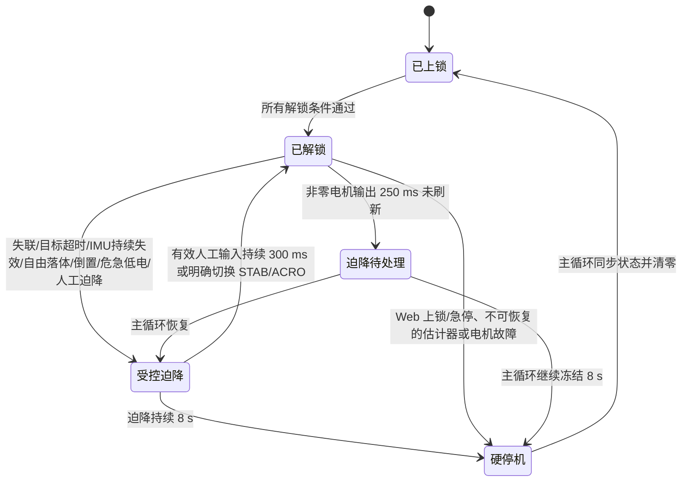

# CF-Drone 飞控固件

基于 Arduino-ESP32 的多旋翼飞控工程，涵盖飞行控制、Web/实体遥控、传感器标定、日志诊断和故障停机保护。请先按实际板型选择构建目标；上锁时正常飞行控制不能启动电机，限时电机自检是唯一例外。

## 阅读导航

- [已完成开发任务](#已完成开发任务)：按功能了解当前实现与能力边界。
- [安全飞行逻辑](#安全飞行逻辑)：解锁门槛、飞行监控、迫降、人工接管和独立停机流程。
- [迫降推力标定与使用方案](#迫降推力标定与使用方案)：起飞后自动标记稳定区间、蓝灯提示、下降末段取值及保存验收。
- [硬件资料](#硬件资料)：支持的板型与硬件工程。
- [构建与刷写](#构建与刷写)：安装依赖、编译、上传和启动检查。
- [使用与排障](#使用与排障)：Wi-Fi 遥控、AUTO 控制及故障日志。
- [开发与验证资料](#开发与验证资料)：专项文档与复核结果。
- [历史开发记录](#历史开发记录)：早期分阶段验收和更新日志。

## 已完成开发任务

以下按当前源码中的功能归类汇总，不把实验数据、构想或待验收目标算作已实现功能。详细提交归属和逐项风险复核见[第一轮功能复核](docs/FEATURE_REVIEW.md)、[235 个提交的第二轮归组](docs/FEATURE_REVIEW_ROUND2.md)及[第三](docs/FEATURE_REVIEW_ROUND3.md)、[第四](docs/FEATURE_REVIEW_ROUND4.md)、[第五](docs/FEATURE_REVIEW_ROUND5.md)、[第六轮复核](docs/FEATURE_REVIEW_ROUND6.md)。

### 板级适配与电机输出

- 建立 ESP32-D、ESP32-C3、ESP32-S3 的板级引脚、串口、SPI、I²C、电池 ADC、LED 和资源配置；ESP32-C3 默认关闭 Wi-Fi/Web，当前 S3 配置禁用未安装的气压计与指南针，ESP32-D 保留相应传感器探测。
- 完成 MOSFET PWM 输出、四电机顺序映射、油门上下限和怠速控制；校验 PWM/ESC 参数组合，重配引脚时解绑并拉低旧引脚。
- 完成上锁状态的开机与网页四电机响应检测：逐路 5% 输出 500 ms、间隔全零 1 秒，保存 IMU 振动基线、逐路采样和判定供网页读取。该流程是上锁零输出规则的唯一例外，每次试转都必须先成功启动独立停止定时器，到期直接清零。检测结果只说明是否测到扰动，不等于转速、旋向或带载推力证明。详见[电机自检记录](MOTOR_SELF_CHECK.md)。

### 飞行控制与停机保护

- 完成物理 RC、Web RC、MAVLink 手动输入和本地动作序列的控制权仲裁；实现 STAB、ACRO、手动及受约束的外部 AUTO 目标，拒绝尚未实现的 ALTHOLD。
- 完成单调步进计时、PID 积分边界、混控去饱和、姿态/角速率控制，以及有界的开环动作序列上传、限速、回放、停止与人工接管。
- 完成零油门解锁门槛、低电压告警和限制、IMU/电机严重故障停机、遥控与 Web 失联保护；零油门怠速失联不会自行抬升电机推力。
- 完成受控迫降、倒置恢复和独立硬停机：迫降最长 8 秒，持续倒置 0.5 秒后尝试水平恢复并迫降；非零电机输出 250 ms 未刷新时，独立任务请求主循环恢复后立即进入受控迫降，若主循环持续冻结 8 秒则独立写零。有效人工摇杆持续偏转 300 ms 可接管并退出迫降；已解锁时加速度模长低于 0.3 g 持续 50 ms 会触发迫降。Web 快速上锁/急停有独立通道，停机原因写入系统事件。详见[飞行停机安全复核](docs/SAFETY_REVIEW_20261004.md)。

### IMU、姿态估计与标定

- 完成 MPU-6500/9250 读取、超时与无效帧处理；无效当前帧不再用旧样本推进姿态估计。电池 ADC 分帧采样，滤波与修正按实际循环间隔调整。
- 完成陀螺仪静止偏置学习、六面加速度计校准、IMU 安装角和机身水平校准；校准数据异步持久化并读回校验，安装角变化后要求重启再解锁。
- 完成基于加速度模长、姿态创新度、振动和摇杆输入的重力修正门控，以及长循环停顿后的估计器限幅；VQF 是可选对照原型，未替换默认飞行估计器。
- 完成高频 IMU 捕获、逐电机振动采样、温度采集及离线回放/参数扫描工具。详见[姿态估计评估](ATTITUDE_ESTIMATOR_EVALUATION.md)与[校准流程](ATTITUDE_CALIBRATION_PROTOCOL.md)。

### 无线网络、网页遥控与调试

- 完成 STA 配网、配置热点、凭据保存与恢复；飞行期间推迟配置门户启动和配置重启，门户只开放配网操作。
- 完成网页摇杆、心跳与摇杆超时判断、单页面控制租约、断线恢复、状态与解锁原因显示；物理遥控解析持续用于诊断，控制命令不与 Web 输入交错。
- 完成手机遥控页面、遥测页面、动作序列录制/上传/回放、迫降参数采样和网页调试控制台；调试页提供常用诊断快捷命令、手工指令输入与四电机扰动检测入口。详见[Web API](docs/web-api.md)、[调试控制台](DEBUG_CONSOLE.md)和[录制回放记录](WEB_RC_RECORDING_VALIDATION.md)。

### 参数与持久化

- 完成飞行、电机、IMU 安装角、Wi-Fi 等参数的范围检查、NVS 保存与启动加载；后台分批写入和读回校验避免在飞行快环中执行同步 Flash 写入，待写入时阻止解锁。
- 完成长参数名的 NVS 键映射、MAVLink 参数 ID 往返、IMU 安装角成对保存及修改后重启门槛；系统事件使用启动批次标识保存和迁移。

### 传感器扩展与数据记录

- 完成 ESP32-D 扩展板 BMP388 气压计、QMC5883P 指南针的探测、读数及校准支持；迫降时仅使用最近 250 ms 内更新的有效气压估计提供有界的快速下降修正，传感器不可用时退回既有推力策略。
- 完成 100 Hz 定长飞行快照、故障前后冻结、串口/Web/MAVLink 分片导出、实时 SSE 遥测及跨启动系统事件记录；飞行快照保存在 RAM，断电后不能恢复。
- 完成循环周期与阶段耗时诊断、最坏循环保留、任务切换和 Flash IPC 专项追踪、Web 请求耗时与链路状态指标；串口、MAVLink 和持久化工作限额或移出飞行快环。详见[循环诊断](CONTROL_LOOP_DIAGNOSTICS.md)。

### 工程交付与复核

- 完成主机回归、网页脚本检查、ESP32-D/C3/S3 构建流程、固件刷写与回读校验记录；按功能完成多轮代码复核，并记录静态存储预算及修复。详见[静态存储复核](docs/STATIC_MEMORY_REVIEW_20261004.md)。
- 2026-10-04 记录的飞行停机版本已在 ESP32-D 和 XIAO ESP32-S3 编译通过；ESP32-D 已完成 app0 写入、独立摘要校验和上锁/四路零输出启动检查。后续源码改动需重新编译验证；编译、刷写和台架结果不代表带桨飞行验收。
- 2026-10-05 完成 Web 内环 PID 配置与自动迫降推力标定改动后，ESP32-D `min_spiffs` 构建再次通过；本次只验证编译和链接，未刷写或进行飞行验收。

当前能力边界：六轴 IMU 不提供绝对航向、位置或可靠触地判断；开环动作序列不是空间航点导航；定高、返航与自动触地停机尚未实现。迫降的 8 秒截止是防堵转上限，高空失联时可能在触地前停机。负载下稳定性、射频失联和各板型接线仍需按实际机体验证。

## 安全飞行逻辑

本节描述当前源码真正执行的安全流程。保护分为四层：解锁前拒绝、主循环内故障处理、受控迫降、独立任务硬停机。告警不一定会改变电机输出；迫降会继续运行姿态控制和电机；硬停机会直接将四路 PWM 写零并随后同步上锁状态。

### 状态与优先级



响应优先级按执行路径理解：

1. Web 快速上锁和急停可在独立网络任务中直接锁存硬停机，不等待主循环。
2. 独立安全任务每约 5 ms 检查迫降、Web 失联和主循环冻结的最终截止时间。
3. 主循环每帧先消费快速停机请求，再读取 IMU、遥控和电池，执行故障保护，然后计算姿态、角速率和电机输出。
4. 普通告警用于 LED、网页、系统事件和飞行快照；只有下文列出的动作条件会改变飞行状态。

### 启动、自检与解锁前门槛

启动时先初始化电机输出和独立安全任务，再初始化 IMU。普通飞行输出要求 `armed=true`；自由落体、日志、参数写入、网页控制请求和残留电机数组都不能在上锁时启动电机。唯一例外是受限的电机自检：普通固件在 Wi-Fi 启动前依次测试四路，也可从网页手工重新执行。每路 5% 输出 500 ms，随后保持全零 1 秒；只有独立停止定时器成功启动后才允许输出，定时器创建或启动失败时拒绝试转。

每次解锁都重新检查以下条件；任一项失败都会保持上锁并返回具体原因：

| 检查项 | 当前规则 |
| --- | --- |
| Web 停机冷却 | Web 上锁或急停后的 2 秒内拒绝重新解锁。 |
| 电机测试互锁 | 电机测试必须处于上锁状态；测试进行时拒绝解锁，结束后需先释放原解锁输入。 |
| 飞行模式 | AUTO 必须已有可用的本地序列或外部目标；ALTHOLD 未实现并被拒绝。 |
| 校准状态 | 加速度计和机身水平校准不得正在运行；IMU 安装角修改或水平基准保存后必须先重启。 |
| 独立安全任务 | 飞行硬停机任务必须创建成功；启用 Web 的构建还要求端口 82 快速停机任务就绪。 |
| 油门 | 解锁输入不得高于 5%。 |
| IMU | IMU 初始化成功，陀螺仪静止偏置已收敛，六面加速度计校准和机身水平校准均已保存。 |
| 电池 | 检测到电池时，电压低于 3.5 V 拒绝解锁；低于 0.5 V 视为未接电池，不应用电池门槛。 |
| 诊断故障 | `IMU_INIT`、`IMU_TIMEOUT`、`IMU_INVALID`、`MOTOR_INIT`、`PARAMETER` 任一活动时拒绝解锁。 |
| 参数和日志写入 | 参数必须有效并完成持久化；NVS 或系统日志正在写入及写入后的保护窗口内拒绝解锁。 |
| 历史硬停机 | 上次硬停机代次必须已被主循环确认，随后才允许清除锁存并解锁。 |

物理 RC 使用低油门加高偏航手势解锁，低油门加反向高偏航手势上锁；Web 使用显式按钮。解锁成功但油门仍在底部死区时，四路电机仅输出 `MOT_THR_MIN` 怠速，姿态和速率 PID 保持复位。油门越过 5% 后才进入正常推力映射和姿态混控。

### 飞行主循环中的安全顺序

每轮主循环按以下顺序处理与安全相关的工作：

1. 消费 Web 快速通道的 `LAND`、`LOCK`、`KILL` 请求；上锁和急停先清零，迫降进入下降流程。
2. 获取新的 IMU 样本。读取超时或非有限数据会置位严重诊断故障；无效帧不会用旧样本继续推进姿态估计。
3. 更新循环时间、物理 RC、Web RC、控制台命令、姿态估计和电池电压。
4. 运行控制输入解释，然后执行 `failsafe()`。故障保护先于本帧姿态、角速率和电机混控计算。
5. 将最终电机值写入 PWM，并更新时间戳心跳；随后再处理串口、日志、MAVLink、参数同步和 LED。

`failsafe()` 内部的检查顺序为：同步已锁存的独立硬停机、处理主循环停顿请求、更新严重诊断、物理 RC 失联、Web RC 失联、AUTO 目标超时、自由落体、倒置、低电池，最后继续已经启动的迫降。前一项若已上锁，后续依赖 `armed` 的动作不会重新启动电机。

### 控制来源与输入有效期

物理 RC、Web RC、MAVLink 手动控制、本地动作序列、外部 AUTO 目标和迫降状态使用统一控制来源标识：

- Web 页面取得控制权后，物理接收机仍解析数据用于诊断，但不覆盖 Web 控制量。
- 最近 250 ms 内收到有效物理 RC 输入，或 Web 控制仍处于活动状态时，MAVLink 手动控制不会抢占控制权。
- 本地动作序列运行时拥有控制权；人工接管、模式改变、调度间隔超过 100 ms、序列结束或一次跨过多个片段都会终止序列，其中调度异常和正常结束进入迫降。
- 外部 AUTO 目标必须连续收到至少 3 个有效目标并覆盖至少 100 ms 才算就绪。实际已应用目标超过 500 ms 未更新会触发迫降；候选目标和旧 RC/Web 会话不能替外部 AUTO 续期。
- 迫降使用独立的 `CONTROL_SOURCE_LANDING`，避免陈旧 RC、Web 或 AUTO 数据在下降期间重新覆盖目标。

### 故障触发与实际动作

| 触发条件 | 判定和防抖 | 实际动作 |
| --- | --- | --- |
| Web `LOCK` / `KILL` | 独立端口 82 校验当前浏览器保存的 `stop` 连续性凭证；它与页面内存中的短期控制租约不同。请求行最多等待 4 ms | 独立任务立即锁存硬停机并直接写零；主循环恢复后记录原因并同步上锁。 |
| Web `LAND` | 有效快速通道请求或页面迫降按钮 | 主循环进入受控迫降；已上锁时拒绝。 |
| IMU 短暂丢帧 | 单帧读取超时或无效，最近有效样本未超过 100 ms | 保持最后一个有限估计状态并继续尝试恢复，不因单帧异常上锁。诊断故障仍保持到连续 100 个好帧后清除。 |
| IMU 持续失效 | 最近有效样本达到 100 ms；IMU 初始化本身仍可用 | 进入有时限受控迫降；不直接空中停桨。若估计器内部状态已经出现 NaN/非法四元数等不可恢复损坏，则立即上锁。 |
| 电机输出或 IMU 初始化失效 | `MOTOR_INIT` 或 `IMU_INIT` 在解锁时活动 | 无法执行可信输出或受控动作，立即上锁并清零。 |
| 物理 RC 失联 | 默认 1 秒未收到新输入；`SF_RC_LOSS_TIME` 可设 0.1～10 秒 | 解锁后曾收到有效飞行输入且当前存在动力时进入迫降；零油门怠速不会自行升推力。解锁前遗留的非零旧输入会直接上锁。 |
| Web RC 失联 | 链路心跳或摇杆包任一超过 8 秒未更新 | 通常进入迫降并释放 Web 控制权。若外部 AUTO 目标仍有效，则保持 AUTO；解锁后从未收到有效摇杆输入时只丢弃旧会话。 |
| 外部 AUTO 超时 | 已应用目标超过 500 ms 未更新 | 锁定受控迫降；恢复发送目标不会自行退出迫降。 |
| 本地序列异常/结束 | 调度间隔超过 100 ms、跨过多个片段或正常完成 | 进入受控迫降；显式人工接管会终止序列并切回 STAB。 |
| 自由落体 | 已解锁且有效 IMU 样本的校准机体系加速度模长低于 0.3 g，连续 50 ms | 立即进入受控迫降；已上锁时不执行动作，不解锁、不启动电机。单个异常样本不会触发。 |
| 持续倒置 | 机体 Z 轴与世界向上方向的点积低于 -0.7，约等于倾角超过 134°，连续 500 ms | 请求水平恢复并进入有时限迫降，不直接上锁；人工接管后如果仍倒置，会再次保持迫降。 |
| 飞行中低电 | 电压低于 3.3 V 只告警；低于 3.0 V 连续 0.9 秒 | 3.3 V 触发诊断和 LED 快闪；3.0 V 锁存受控迫降，直到最终上锁。 |
| 解锁怠速低电 | 推力目标低于 0.15，电压低于 3.5 V 连续 0.9 秒 | 自动上锁并清零。 |
| 主循环输出心跳超时 | 已解锁且最近输出非零，250 ms 没有刷新电机心跳 | 独立任务锁存迫降请求。主循环恢复后在下一次输出前进入迫降；若继续冻结 8 秒则直接写零。 |
| 循环周期超过诊断阈值 | `dt` 达到 1.5 ms 告警阈值 | 记录循环阶段、系统事件和故障快照；本身不改变电机输出，250 ms 输出心跳负责最终安全动作。 |

电机心跳跨核读取使用有符号回绕安全比较。主循环先发布刷新时间，再发布“非零输出”标志，避免安全任务先读取旧时间、随后看到新输出标志而产生无符号下溢误判。

### 受控迫降流程

所有迫降入口复用同一个 `descend()` 状态，具体流程如下：

1. 若当前已经上锁，不产生电机输出。若飞控虽已解锁但处于零油门怠速，并且最近 200 ms 内没有有效动力交接，立即上锁；这样迫降请求不会从零主动抬升电机。
2. 首次进入时锁存迫降状态、记录起始时间、把控制来源设为 `LANDING`，并将模式切换为 AUTO。
3. 若页面松开油门后 200 ms 内触发迫降，可从最近的有效动力推力接续，起始推力最高不超过悬停前馈，避免先掉到零再缓慢升回。
4. 姿态目标固定为水平滚转和俯仰，偏航目标每帧跟随当前偏航；所有姿态和角速率 PID 积分在进入时清零。
5. 推力按实际 `dt` 和 `SF_DESCEND_TIME` 平滑趋近 `SF_DESCEND_THRUST`。默认下降目标为 0.42，过渡时间为 3 秒；目标始终限制在 `MOT_THR_MIN` 到悬停前馈 0.48 之间。
6. 有可用气压计的板型仅在样本不超过 250 ms、相对起飞面高度至少 1 m 且下降速度快于 0.4 m/s 时增加推力，最大修正 0.025。气压计不会降低基础下降推力，也不负责触地判断；没有气压计的板型使用固定推力策略。
7. 迫降启动后设置独立的 8 秒硬截止。主循环和独立任务都能执行截止；到期后四路输出归零并上锁。

主循环停顿的特殊流程分两段：250 ms 输出未刷新只锁存请求，避免短暂调度停顿在空中直接断电；主循环恢复后重新获得完整的 8 秒迫降窗口。如果主循环始终没有恢复，独立任务在检测到停顿约 8 秒后直接写零，防止永久保持最后一次非零 PWM。

### 人工接管迫降

迫降期间仍持续接收物理 RC、Web RC 和允许的 MAVLink 手动包。满足以下全部条件时，飞手可以接管：

1. 最近一次有效输入距当前时间不超过 250 ms；
2. 油门达到 10%，或横滚、俯仰、偏航任一轴偏转达到 15%；
3. 上述状态连续保持 300 ms。

接管成立后记录 `LANDING_EXIT`，清除迫降状态与其硬截止，切换到 STAB，并在当前控制周期重新应用人工摇杆。明确切换 STAB/ACRO 也会解除迫降。危急低电已经锁存时，电池保护会再次请求迫降；仍处于自由落体条件时，自由落体检测也会在重新满足 50 ms 条件后再次触发。Web 上锁、急停和物理上锁手势始终优先于接管。

### 独立硬停机路径

`flight_hard_stop` 任务固定在核 0、优先级 3，每约 5 ms 检查以下截止时间：

- 迫降开始后 8 秒；
- 非零电机输出心跳停顿后 8 秒；
- Web 最后更新时间超过失联 8 秒加迫降 8 秒，即总计 16 秒。

截止到期后调用统一的电机紧急锁存：增加代次、保存原因，并绕过飞行控制计算直接写四路零占空比。`sendMotors()` 在正常输出后还会再次检查锁存和电机测试截止，关闭并发到达导致最后一次非零写入覆盖停机值的竞态。主循环下次运行时读取锁存原因，执行完整上锁清理并记录 `HARD_STOP`。

### 上锁后的统一清理

任何上锁来源都会执行同一套清理：

- 取消正在运行的单电机试转和振动检测；
- 清除迫降和主循环停顿的截止时间与待处理请求；倒置状态在下一帧复位；
- 将 `armed` 置为 false，清零推力目标和四路电机数组，并立即发送零输出；
- 失效力矩目标，清除外部 AUTO 目标状态；
- 保存上锁原因，并在飞行快照中编码 `DisarmReason`；
- Web 上锁或急停额外启动 2 秒重新解锁冷却。

单电机测试只允许在上锁、输出和 IMU 状态满足条件时运行，输出范围限制为 5%～30%、时长限制为 50 ms～3 秒。开始前清除其他三路输出，先启动独立停止定时器，再写入目标电机输出；结束、上锁命令、急停或异常中止都会清零并取消后续序列。除这个受限测试状态外，`armed=false` 时输出层强制写零。

### 自动上锁审查结论

| 自动上锁入口 | 审查后的处理 |
| --- | --- |
| 单帧 IMU 超时或无效样本 | 已删除立即上锁；100 ms 内等待恢复，持续失效后迫降。 |
| 持续倒置 | 已删除直接上锁和独立倒置截止；改为水平恢复与迫降。 |
| 自由落体 | 只在已解锁时迫降；上锁时不改变状态。 |
| 迫降请求发生在零油门怠速 | 保留自动上锁，防止保护动作自行抬升电机。 |
| 解锁怠速低电 | 保留 0.9 秒防抖后的自动上锁；飞行推力下改走危急低电迫降。 |
| 解锁前陈旧 RC 数据产生非零目标 | 保留自动上锁，阻止旧指令驱动电机。 |
| 迫降持续 8 秒 | 保留最终硬截止，用于限制触地后堵转；高空提前停机风险在安全边界中明确记录。 |
| 主循环永久冻结或 Web 失联且主循环无法处理 | 保留独立最终硬截止；主循环能够恢复时优先迫降。 |
| 估计器内部非有限、电机输出初始化失效或 IMU 初始化失效 | 保留立即上锁，因为已无法形成可信闭环或输出。 |

Web/物理 RC/MAVLink/CLI 的明确上锁和急停属于操作员命令，不计入自动上锁；这些入口继续立即清零。

### 告警、日志与复核依据

- 正常上锁时 LED 熄灭，正常飞行时约 1 Hz 慢闪；活动诊断故障、倒置、失联或低电时约 8 Hz 快闪。蓝灯快闪表示存在告警条件，不等同于已经执行硬停机。
- 诊断状态变化写入 `DIAG`，迫降写入 `LANDING` 和 `LAND_BARO`，自由落体写入 `FREE_FALL`，人工接管写入 `LANDING_EXIT`，独立停机写入 `HARD_STOP`。
- 飞行中严重故障和上锁会触发 100 Hz RAM 快照保留；循环超时另保存逐阶段耗时和最坏记录。系统事件可跨启动保存，但飞行快照断电后丢失。
- 关键安全参数可用 `diag brief`、`diag`、`rc`、`imu`、`log status` 和 `log dump` 复核。故障后应先保存日志，再断电或重启。

### 当前安全边界

- 固件没有位置、地形、近地测距或触地传感器。迫降以定姿态、定推力下降为主体；ESP32-D 扩展板上可用的 BMP388 估计只对过快下降做有限增推保护，不提供高度闭环。8 秒截止用于限制触地后堵转时间，高空故障时可能在落地前停机。
- IMU 单帧异常不会停机；持续 100 ms 没有有效样本会使用最后的有限姿态状态尝试迫降。传感器长期失效时无法保证姿态控制质量，8 秒最终截止仍可能在空中停机；估计器状态已经非有限时则立即停机。
- 自由落体检测基于近零比力。抛掷、特殊机动或异常校准可能满足条件；50 ms 连续窗口用于降低单点误触发。检测只在已解锁状态生效，上锁后不会启动电机。
- 倒置保护依赖主循环先得到有效姿态并识别倒置；持续 500 ms 后尝试水平恢复和迫降，不直接停桨。若主循环先冻结，则由电机输出心跳路径处理。
- Web 快速停机拥有独立任务和端口，但仍依赖 Wi-Fi、TCP 请求和有效控制租约；实体遥控上锁手势仍依赖主循环读取 RC。
- 电池阈值按单节电池电压设计，ADC 分压比、负载压降和电池节数必须与实际硬件一致。
- S3 目标没有气压计和指南针；ESP32-D 可探测扩展传感器。指南针不参与上述迫降闭环，气压计只提供有界的快速下降推力修正。

实现位置主要位于 `control.ino`、`safety.ino`、`motors.ino`、`diagnostics.ino`、`battery.ino`、`web_rc.ino` 和 `log.ino`；专项复核见[飞行停机安全复核](docs/SAFETY_REVIEW_20261004.md)。

## 迫降推力标定与使用方案

当前标定自动记录候选区间，取最后稳定下降候选段的平均推力，不使用高度差或目标下降速度计算参数。实际迫降仍按上文的受控迫降流程执行，气压保护和硬停机截止继续生效。

### 操作流程与状态

| 阶段 | 飞手操作 | 系统行为与完成条件 |
| --- | --- | --- |
| 开启标定 | 起飞前，在已上锁、电机停止时开启标定，并确认机体和桨叶配置。 | 绑定设备、固件、配置和本次记录编号；只观察飞行，不自动解锁或改变推力。 |
| 起飞等待 | 手动解锁并起飞，保持自稳模式。 | 检测到起飞代理信号后等待 3 秒，再开始稳定区间检查；解锁怠速不启动计时。 |
| 悬停候选标记 | 飞手保持实际悬停，无需点击页面。 | 姿态、推力和杆量连续稳定 5 秒后，冻结该段平均推力，完成悬停候选标记；期间不合格则重新计满 5 秒。 |
| 蓝灯提示 | 看到蓝灯提示后缓慢降低油门，手动建立稳定下降。 | 标记完成后蓝灯快闪 5 次、熄灭 1 秒，循环提示；进入下降候选段后结束提示。 |
| 下降候选采集 | 保持稳定下降，无需松手操作页面。 | 检测到主动降低油门，且推力低于悬停候选值后进入过渡等待；稳定后滚动计算连续 3 秒窗口，保留最后一个合格窗口。 |
| 结束记录 | 手动着陆并明确上锁。 | 收杆、推力或姿态明显变化时停止更新候选，保留此前最后合格窗口；上锁后结束本次记录。故障或急停导致中止时，本次候选不可保存。 |
| 确认保存 | 上锁后查看结果，确认标记时确实悬停、候选段确实稳定下降，再确认保存。 | 校验身份、配置、有效期、执行范围及记录质量，通过后保存 `SF_DESCEND_THRUST`；飞行中不自动写入参数。 |

“起飞代理信号”采用已解锁且目标推力连续 500 ms 高于 `MOT_THR_MIN + 0.03` 的条件；代理确认后才开始 3 秒等待。它不能证明机体已经离地，后续应结合实飞日志复核门槛，不能用解锁时刻替代起飞计时，也不能把地面怠速当成悬停。没有有效高度信息时，姿态与推力稳定无法区分悬停、匀速爬升或下降，因此自动状态称为“候选”，由飞手在保存前确认实际飞行过程。

### 蓝灯提示契约

- 悬停候选标记完成后：亮 100 ms、灭 100 ms，重复 5 次，再额外熄灭 1 秒，循环往复。
- 检测到下降候选段、取消标定、上锁或中止时结束提示，恢复对应的正常灯态。
- 故障和安全告警灯态优先，标定提示不能遮盖告警。
- LED 使用非阻塞计时，不允许通过延时等待影响飞控循环；页面同时显示标定阶段和质量状态。

### 推力计算与记录质量

候选迫降推力取悬停标记之后、最后一个连续稳定下降候选窗口的时间加权平均值：`平均推力 = Σ(推力 × 有效持续时间) / Σ有效持续时间`。窗口固定为 3 秒，悬停候选平均推力使用连续 5 秒窗口；两者采用与迫降执行相同单位的归一化推力指令，不使用摇杆百分比或电机混控后的单路输出代替。

- 每个窗口必须保持自稳模式、有效姿态、无飞行故障，并检查采样覆盖率和最大采样间隔；不能跨采样空洞拼接。
- 姿态和推力稳定检查使用最大倾角 10°、窗口内推力最大最小差不超过 0.05、姿态变化不超过 3°、杆量变化不超过 5%；这些门槛后续仍需根据实飞记录复核。
- 下降候选平均推力必须低于本次悬停候选平均推力；降低油门只用于阶段识别，不能单独证明下降方向。
- 排除收杆、触地过渡、人工接管后的过渡及气压迫降保护介入的样本。系统没有可靠触地检测，末段是否为真实空中下降仍需飞手确认。
- 末尾不足 3 秒或不稳定时，保留此前最后完整合格窗口，并在页面显示它与记录结束之间的间隔；不能将它描述成记录结束前的最后 3 秒。
- 没有合格下降窗口时拒绝生成候选，不回退到整段平均值，不自动猜测推力。
- 候选必须位于保存接口与实际迫降执行共同允许的范围内，包括 `MOT_THR_MIN` 和悬停前馈上限；会被限幅的值拒绝推荐，不能静默保存后改变执行值。

记录必须在采集时固定设备、固件、机体、桨叶配置、记录编号及时间，而非在添加候选时重新绑定。同一记录只能产生一个有效候选；有效期按采集时间计算，为 30 天，重复保存不能刷新期限。上锁后保存前再次核对配置、记录身份和有效期。页面展示悬停平均推力、下降候选平均推力、差值、样本质量、平均电池电压及候选未通过的原因。

### 保存后的迫降使用与验收

1. 保存后等待持久化完成及读回确认，再开始下一次飞行；未确认成功时不视为标定完成。
2. 首次使用新候选进行可人工接管的短时迫降验证，记录基础推力、气压修正、实际输出和飞手观察到的下降效果。标定采集期间不自动触发迫降。
3. 迫降采用保存的基础推力并平滑过渡；有效气压信息仍可对过快下降作有界修正。标定计算不依赖高度，不等于关闭运行时气压保护。
4. 到地后飞手明确上锁；当前固件不判断触地，现有 8 秒截止仍是硬停机上限，不能用于证明已经着陆。
5. 电池、载荷、机体或桨叶变化后重新评估候选；配置不匹配、过期或飞行验证不合格时重新标定。固定推力无法保证不同条件下的下降速度。

验收覆盖：解锁怠速不误触发、起飞后 3 秒等待、连续 5 秒稳定标记及重计时、蓝灯完整循环与告警优先、稳定下降 3 秒窗口、末段收杆保留上一窗口、无效采样与故障中止、无合格候选拒绝、重复记录不延长有效期、配置变更拒绝保存，以及断线或页面刷新不重置板端记录状态。

## 硬件资料

固件包含 ESP32-D、ESP32-C3 和 ESP32-S3 板级配置，支持 MPU-6500/9250 系列 IMU。各板型的 Wi-Fi、扩展传感器与引脚配置见 `board_config.h`。

琛光 E1 系列硬件工程：[E1 Mini](https://oshwhub.com/songge8/project_qqqyfdkm)、[E1 Nano](https://oshwhub.com/songge8/project_fnvbukbz)。

## 构建与刷写

本项目是 Arduino IDE/Arduino CLI 工程，不使用 PlatformIO、ESP-IDF 的 CMake 工程或 `platformio.ini`。固件源文件位于仓库根目录，主入口为 `CF-Drone.ino`。

### 开发依赖

- **Arduino IDE 2.x 或 Arduino CLI**：负责预处理 `.ino` 文件、编译和链接固件。仓库的 `tools/build_esp32d.sh` 默认使用 Arduino IDE 自带的 CLI；也可以通过 `ARDUINO_CLI` 指定其他安装位置。
- **Espressif Arduino-ESP32 开发板平台**：本次本机编译使用 `esp32:esp32` **3.3.8-cn**。板级支持包提供 ESP32/C3/S3 工具链以及 `WiFi`、`WebServer`、`Wire`、`SPI`、`Preferences` 等核心库。
- **MAVLink Arduino 库**：固件依赖 `MAVLink` 库；本次编译解析到的版本为 **2.0.33**。需将其安装到 Arduino 库目录（Arduino IDE 的库管理器或手动安装均可）。
- **主机回归（可选）**：运行 `tests/run_host_tests.py` 需要 Python 3 和支持 C++17 的 `clang++` 或 `g++`；网页脚本测试还需要 Node.js。固件编译本身不需要 Python 或 Node.js。

首次配置时，在 Arduino IDE 的开发板管理器安装 Espressif ESP32 平台，并在库管理器安装 MAVLink。选择对应芯片板型后，确认 MAVLink 库可被 Arduino CLI 找到。项目没有将 Arduino 平台和 MAVLink 版本锁定在仓库配置文件中；上面的版本是本次验证环境的版本。

### 编译固件

在仓库根目录可以使用 Arduino CLI 编译。ESP32-D 使用 `min_spiffs` 分区方案，为当前固件留出足够的应用空间：

```sh
arduino-cli compile --fqbn esp32:esp32:esp32:PartitionScheme=min_spiffs .
```

其他板型：

```sh
# ESP32-C3
arduino-cli compile --fqbn esp32:esp32:esp32c3 .

# ESP32-S3；默认分区的应用空间不足，需选 min_spiffs
arduino-cli compile --fqbn esp32:esp32:esp32s3:PartitionScheme=min_spiffs .

# Seeed XIAO ESP32-S3（若实际硬件为此板型，使用它自己的 8 MB 分区选项）
arduino-cli compile --fqbn esp32:esp32:XIAO_ESP32S3:PartitionScheme=default_8MB .
```

ESP32-D 也可使用仓库脚本，它会把构建产物放在临时目录：

```sh
./tools/build_esp32d.sh
```

脚本默认查找 `/Applications/Arduino IDE.app/Contents/Resources/app/lib/backend/resources/arduino-cli`；其他安装路径可这样指定：

```sh
ARDUINO_CLI=/path/to/arduino-cli ./tools/build_esp32d.sh /tmp/cf-drone-build
```

### 刷写与启动检查

刷写前先拆下全部螺旋桨并固定机体。ESP32-S3 固件启动时会执行电机输出自检；拆桨后再连接 USB 和电池供电。选择与实际芯片和板卡匹配的 FQBN、分区方案及串口，不能因为外观相似就混用 ESP32、C3、S3 镜像。

先找到 USB 串口：macOS 可查看 `/dev/cu.*`，Linux 可查看 `/dev/ttyUSB*` 或 `/dev/ttyACM*`，Windows 可在设备管理器查看 `COM` 端口。若没有端口，检查 USB 数据线、USB-UART 驱动和设备下载模式。把下面的 `<串口>` 替换为实际端口，例如 `/dev/cu.usbserial-10` 或 `COM5`。

#### 新机器首次刷写

1. 按上文安装 Arduino-ESP32 平台和 MAVLink 库，确认开发板型号及 USB 串口。
2. 在仓库根目录执行对应板型的命令。`compile --upload --verify` 会先编译，再上传并校验；单独执行 `arduino-cli upload` 不会重新编译：

   ```sh
   # ESP32-D
   arduino-cli compile --upload --verify --fqbn esp32:esp32:esp32:PartitionScheme=min_spiffs --port <串口> .

   # ESP32-C3
   arduino-cli compile --upload --verify --fqbn esp32:esp32:esp32c3 --port <串口> .

   # ESP32-S3
   arduino-cli compile --upload --verify --fqbn esp32:esp32:esp32s3:PartitionScheme=min_spiffs --port <串口> .

   # Seeed XIAO ESP32-S3（仅当实际板卡为此型号）
   arduino-cli compile --upload --verify --fqbn esp32:esp32:XIAO_ESP32S3:PartitionScheme=default_8MB --port <串口> .
   ```

3. 若芯片未自动进入下载模式，按住板上的 `BOOT`，短按 `RESET/EN`，开始连接后松开 `BOOT`；不同开发板的按键时序可能略有不同。
4. 上传完成后打开 115200 baud 串口监视器，确认出现 `BOOT` 和“程序初始化完成”。输入 `diag brief`、`imu`、`rc` 检查上锁状态、IMU、遥控接收和活动故障。C3 目标关闭 Wi-Fi/Web；ESP32/S3 可按“手机 Wi-Fi 遥控”一节配置 `Drone_WiFi` 热点。
5. 新出厂或尚未校准的传感器，在电机停止、机体按提示依次静置于六个方向时执行 `ca`，并确认串口提示参数写入且读回验证成功。按实际机架、接收机和电机接线检查板型引脚与参数；不要因烧录成功就直接解锁。

#### 同一台机器二次刷写

1. 拆桨、断开电池和 USB 后接好 USB；再次确认板型和串口。先断电可避免刷写过程中意外给电机供电。
2. 运行上面的同一条 `arduino-cli compile --upload --verify` 命令。正常更新不需要先执行全片擦除；继续使用与设备现有分区一致的板型选项。
3. 普通刷写会保留 NVS 中的参数、Wi-Fi 凭据和持久系统日志；重启后用 115200 baud 串口检查 `BOOT`、`diag brief`、`imu`，并确认飞控仍上锁、电机输出为零。ESP32/S3 的 Wi-Fi 凭据通常无需重新输入；如设备进入配置热点，可按“手机 Wi-Fi 遥控”恢复连接。
4. 只有明确要清除旧设备配置或排查 NVS/分区损坏时，才考虑全片擦除。全片擦除会删除已保存的参数、Wi-Fi 凭据和日志；擦除后按“新机器首次刷写”重新配置。改变板型或分区方案也可能使已有分区数据不可用，先记录需要保留的参数，再进行迁移。

串口监视器会独占串口，开始上传前先关闭监视器。烧录、启动和诊断检查只验证固件与基础硬件初始化；不替代拆桨检查、遥控方向/失联检查，也不构成带桨或飞行验证。

### 最近构建验证

使用 Arduino-ESP32 **3.3.8-cn** 和 MAVLink **2.0.33** 的最近构建记录：

| 目标板型 | 分区 | Flash | 静态 RAM | 状态 |
| --- | --- | ---: | ---: | --- |
| ESP32-D | `min_spiffs` | 1,430,395 / 1,966,080 B | 115,388 / 327,680 B | 2026-10-05 通过 |
| XIAO ESP32-S3 | `default_8MB` | 1,349,663 / 3,342,336 B | 123,424 / 327,680 B | 2026-10-04 通过 |
| ESP32-C3 | 默认 | 545,582 / 1,310,720 B | 71,740 / 327,680 B | 较早记录，本次未重编译 |

这些是链接时的程序空间和静态 RAM 用量，不代表运行时堆余量或硬件飞行验证。板型和分区方案必须与实际硬件匹配；烧录验证也不等于带桨或飞行测试。

主机回归可运行：

```sh
python3 tests/run_host_tests.py
```

## 使用与排障

### 手机 Wi-Fi 遥控

首次上电或飞控连不上已保存的路由器时，会开启无需密码的 `Drone_WiFi` 配置热点。手机暂时连接该热点，打开 `http://192.168.4.1/wifi`，点击“扫描 Wi-Fi”并选择附近的 2.4 GHz 路由器，再输入密码。隐藏网络可手动填写 SSID。配置保存后飞控自动重启并连接路由器；随后把手机也切回同一个路由器 Wi-Fi，在串口 `wifi` 输出中查找飞控 IP，并访问 `http://<飞控IP>/` 控制。手机在配网页面那几分钟会暂时离开原 Wi-Fi，完成后手机和飞控同处一个路由器网络，手机可正常通过该网络上网。

飞控 STA 连接超时 20 秒后会重新开放配置热点；配置页也能从遥控器页面底部的“Wi-Fi 设置”进入。Web 配网页面使用 HTTP，密码只保存在飞控 NVS，不会写入日志。

使用实体遥控器时，用 `/telemetry` 查看只读数据。网页遥控页面取得有效摇杆输入后会接管控制，实体接收机仍解析帧用于诊断，但不会与网页命令交错覆盖控制量。两种遥控输入不要同时操作；网页摇杆包停止超过 8 秒会触发失联下降，即使心跳仍在。

### 外部 AUTO 控制（六轴）

外部目标不会自动解锁。先连续发送至少 3 个有效目标且覆盖至少 100 ms，再显式切换 AUTO、显式解锁；两个有效目标的间隔不得超过 500 ms。目标须为有限值，四元数归一化前模长在 0.5–1.5，推力在 0–1，角速度不超过当前配置上限。支持姿态、三轴速率或两者组合；不支持部分轴速率掩码、忽略推力或推力向量扩展。直接电机目标仅接受组 0 的四路 0–1 指令。

AUTO 使用自己的目标超时，旧的 RC/Web 会话不决定其存活状态。按实际已应用目标计算 500 ms 超时，准备中的候选目标不能续期。目标超时后锁定持续下降，恢复发包不会自动解除下降；飞手可明确切换 STAB/ACRO 接管或上锁。RAW 不能接管下降。ALTHOLD 未实现，各模式入口拒绝该模式，旧遥控模式参数回退自稳。

### 日志排障

#### 启动和网络事件

Wi-Fi 配置在保存后会通过 NVS 读回验证；验证失败时网页会明确报错且不会安排重启。启动和 Wi-Fi 连接阶段的关键状态进入容量为 12 条的 RAM 事件环形缓冲，并经 SSE 回放到 `/wifi` 配网页；配网页捕获不依赖串口，也不会将高频飞行日志写入 Flash。打开配网页即可查看并下载启动/Wi-Fi 事件日志；日志包括启动复位原因、NVS 状态、配网热点、SSE、连接、保存和重启状态，不记录 Wi-Fi 密码。

#### 串口预检和系统事件

后续排障以串口日志为准：串口设为 **115200 baud**，先开始保存完整输出，再给飞控上电。启动记录 `BOOT` 包含固件编译时间、芯片/版本、Flash 容量和上次复位原因；故障触发和恢复以 `DIAG` 事件写入固定事件缓冲，可在 SSE 系统事件流查看；`diag` 提供当前电池、RC、IMU/电机及循环统计上下文，`diag brief` 输出 `arm_ready`、完整解锁阻断原因和活动故障摘要，100 Hz 快照提供故障前后采样。飞行中不逐条同步打印串口。

每条系统事件保存自身 `bootId`，SSE 的事件 ID 使用该标识与序号；重启恢复的事件保留原启动批次。旧 784 B 持久格式迁移为 v2 的 836 B 格式，旧事件启动批次无法恢复，明确记为 0（未知）。Flash 仍仅在上锁且无电机测试时节流写入，不能保证掉电前最后一刻的事件已经持久化；重要测试应同时保留外部日志。

#### 主循环卡顿诊断

`diag` 的 `LOOP_TIMING` 报告有效/无效样本数、最大周期、超过 1,000/1,500 μs 的次数、估算遗漏整周期数，以及 P99 所在桶的上界（不是精确 P99）。故障阈值从 10 ms 降为 1.5 ms；`LOOP_STAGE` 分别统计 IMU、控制、ADC、网络等阶段的指数滑动平均（λ=15/16）、最大值与预算超限次数。预算用于诊断，不会中断计算。`whole_loop` 是整轮经过时间，包含等待 IMU，不能当作纯 CPU 利用率。

热路径使用固定枚举索引、整数 EMA 和计数，每 5 秒最多汇总一条阶段告警；`diag clear` 重置统计但保留当前故障。每次 `dt>1,500 μs` 时，固件将对应时间区间的 16 项细分耗时写入 RAM 环形缓冲（普通构建 32 条；带调度器追踪的内存受限构建 19 条）；记录按同一 `dt` 对齐上一轮主体、轮间间隙和本轮 IMU。基础记录每条 80 B（4 个 32 位元数据字段和 16 个 32 位阶段耗时），另保留一条历史最大 `dt` 记录；带调度器追踪时峰值记录占用一个原环形槽位。记录不写 Flash、不打印。

上锁后可用 `GET /diag/trace.csv` 导出环形记录，用 `GET /diag/trace/worst` 获取历史最大超时的阶段快照；后者可在普通环形记录被覆盖后继续保留最严重事件。CSV 固定列序包含 `unaccounted_us`，用于观察计时区间内无法归属到已测阶段的部分。测试分析需区分启动/上锁导出造成的长周期与实际飞行期间的退化。

#### 加速度计校准

加速度计校准命令为 `ca`：按提示静止完成六面采样。校准逐步运行，不阻塞控制循环；结果超出范围时保留旧值，并提示检查六面方向后重新运行 `ca`。有效结果写入 NVS 并读回验证；只有显示“参数已写入并读回验证”才表示保存成功。`ca` 不校准陀螺仪偏置或 IMU 安装方向。姿态估计由陀螺仪提供快速变化；空中仅在加速度模长接近 1g、且横滚/俯仰摇杆基本回中时，才用加速度方向做带置信度的低频滚转/俯仰重力修正。强加速和明显摇杆输入会淡出该修正；六轴 IMU 不提供绝对航向参考。

#### 故障时采集

故障出现后，在重启或断电前通过串口输入以下命令并保存完整输出：

* `diag`：当前状态及本次上电以来出现过的故障、持续时间和诊断上下文；`diag brief` 输出轻量安全预检摘要。
* `imu`：传感器型号、识别码、驱动状态和当前测量数据。
* `rc`：遥控通道、控制量和最近接收时间。
* `sys`：芯片温度、剩余堆内存及任务运行信息。
* `log dump`：导出 100 Hz、最多 400 条机载快照，包含姿态、电池、RC、故障位及四路电机输出。正常滚动时约为最近 **4 秒**；故障触发后保留约 3 秒前史和最多 1 秒后史，之后停止覆盖。实际覆盖时长取决于采样间隔；上锁也会触发后史保留。稳定性分析列还包括 `dt_s`（主循环周期）、校准并旋转到机体坐标系的 `gyro_*`/`acc_*` 和实际飞行模式（0=RAW、1=ACRO、2=STAB、4=AUTO（含下降状态；3=ALTHOLD 不支持））。陀螺仪单位为 rad/s，加速度为 m/s²，角度为 rad；`motor_*` 是归一化电机指令（0～1），不是转速反馈。
* 浏览器实时日志：访问 `http://<飞控IP>/telemetry`，点击“开始捕获”，结束后下载 CSV。页面通过 SSE 接收 2 Hz 最新样本；网页暂时断线会自动重连，但断线期间样本不补传。机载 100 Hz 快照可用页面“下载故障快照”、`GET /logs.csv` 或串口 `log dump` 导出。冻结期间实时页面仍更新。

#### 飞行快照格式与导出

日志内部格式 v1 每条 80 B，400 条占 32,000 B，另保留独立实时样本。前 35 个 CSV 列的顺序与单位不变，末尾扩展字段包括 `rate_i_x/y/z`（I 项输出）、`mix_scale`（混控力矩缩放比）、`control_source`（0=无、1=物理遥控、2=Web、3=本机序列、4=外部姿态/角速率、5=外部电机、6=下降）和 `accel_correction_confidence`（加速度重力修正置信度，0–1，按 1/63 量化保存在内部质量字节中）。量化步长：角速率 1/512 rad/s、加速度 1/128 m/s²、姿态角 1/8192 rad、I 项 1/1024、推力/混控比 1/32768，dt 为 1μs；NaN 与正负溢出分别保留为 NaN/Inf，不伪装为有效限幅值。记录用于趋势及故障定位，不替代原始传感器全速采集。

人工冻结、导出与恢复仅允许在上锁且电机停止时进行。`log status` 或只读 `GET /logs/status` 查看采样状态、批次、原因与漏采数；`log resume` 或页面“恢复机载记录”（`POST /logs/resume`）清除当前 RAM 快照并开始新批次，先保存需要的快照。故障后采样尚未完成时返回忙，等待约 1 秒再操作。`log clear` 只清持久事件，不解除飞行快照冻结。

串口每帧最多写 64 B，新命令或解锁会取消导出；Web CSV 在后台任务分行发送，页面检查行数，拒绝保存截断文件。MAVLink 日志 ID 0 使用前 35 列、小端 float32、140 B/行的虚拟字节流，按 `ofs/count` 每帧最多发一个 90 B 片段，支持非对齐读取、EOF 和 `LOG_REQUEST_END`；恢复采样会使旧批次的传输失效。MAVLink 控制台文本采用固定 1 KB 队列，溢出有计数提示。解锁或电机测试期间，大输出和参数修改命令被拒绝，短告警仅进入固定事件缓冲。

#### 迫降与电机停机

自动下降（RC 失联、电池危急、网页迫降或路线结束）会保持水平姿态，并将推力平滑过渡到 `SF_DESCEND_THRUST`；`SF_DESCEND_TIME` 控制推力变化斜率。网页松开油门后 200 ms 内启动迫降时，固件从最近的有效动力推力接续（最高不超过悬停前馈），避免先归零再缓慢加推力；超过该窗口不会恢复旧推力。如果下降请求发生在零油门怠速，且 200 ms 内没有有效动力交接，固件会立即停机上锁，不会从零自行增加到下降推力。迫降入口数值会写入系统事件。

BMP388 估计有效、更新时间距当前不超过 250 ms，且相对起飞面高度至少 1 m 时，若估计下降速度快于 0.4 m/s，固件最多增加 0.025 推力作为单向快速下降保护；传感器失效时平滑退回既有定推力值。当前实飞调校的悬停前馈为 0.48、迫降目标为 0.42。迫降最长维持 8 秒，到期后由独立安全任务强制将四路输出写零；这是防止触地后持续堵转烧机的终止上限，高空失联时可能在未触地前停机。推力值是归一化电机指令，仍需在安全条件下按机体验证和调整。气压计不能可靠判断厘米级近地高度或触地，因此该 8 秒上限是安全截止，不是触地检测。

#### 网页油门与迫降标定

网页左摇杆采用弹簧油门：页面刚打开时仍位于零油门，取得页面控制权本身不会发送摇杆包；飞手操作后松手，偏航回中，油门在约 300 ms 内平滑回到飞控按 `ALTHOLD_HOVER_THRUST`、当前 `MOT_THR_MIN/MAX` 和网页油门缩放反算的悬停基础档位。当前实飞调校值页面显示约 50%，对应归一化目标推力 0.48。油门缩放过低导致悬停推力不可达时，摇杆回到允许的最高油门并在页面提示。该档位只是悬停推力前馈，不会自动消除已有升降速度或保持高度；定高仍需要独立的高度闭环。

解锁检查始终要求零油门；悬停回位值不参与解锁门槛。解锁成功且油门仍在零位时，四路电机以 `MOT_THR_MIN` 一致怠速转动，姿态 PID 此时保持复位。提高油门越过 5% 控制死区后才进入正常姿态混控；上锁或急停会立即把四路输出清零。

网页遥控器顶部“迫降标定”不使用高度或下降速度：`DCAL-1` 起飞前在上锁状态开启标定并绑定当前设备、固件、机体标识和桨叶配置；`DCAL-2` 解锁后，固件以推力持续高于怠速作为起飞代理信号，3 秒等待从该代理信号首次成立时开始计算，不能从解锁时刻开始；`DCAL-3` 等待结束后自动寻找连续 5 秒姿态、推力和杆量稳定的悬停候选区间，不合格时从零重新计时。区间通过后机身蓝灯以亮灭各 100 ms 快闪 5 次、熄灭 1 秒的方式循环，并在页面显示“悬停候选／稳定标记完成，可以缓慢下降”。检测到下降、上锁或取消标定后结束提示；故障灯态优先。该标记不能证明真实悬停，因为同样的稳定状态也可能出现在匀速爬升中。

`DCAL-4` 稳定标记完成后，固件检测到油门杆相对标记值持续降低时自动开始下降候选记录，不接管摇杆、模式或推力；`DCAL-5` 在下降期间滚动检查最近连续 3 秒窗口，只有采样连续、无故障、保持自稳和手动控制、没有气压迫降保护介入、横滚/俯仰不超过 10°、姿态/推力/杆量稳定，且时间加权平均推力低于稳定标记平均推力并位于 `MOT_THR_MIN` 到悬停前馈的实际迫降执行范围内时，才更新候选。触地或收杆造成末段失稳不会覆盖此前已经完成的有效候选；如果从未形成完整有效窗口，本次标定失败。`DCAL-6` 落地上锁后记录冻结，页面显示稳定标记平均推力、最后一个有效 3 秒候选推力、两者差值和质量结果，飞手确认后才写入 `SF_DESCEND_THRUST` 并等待 NVS 读回。原始样本只暂存在飞控 RAM，重启会清除；首次保存后仍需另行进行低高度迫降试飞验证。

#### 姿态与卡顿分析

分析抖动或姿态不稳时，保持串口持续记录，在安全、空旷场地先做短时低高度测试；落地后立即执行 `log dump` 并保存 CSV。重点对齐摇杆变化、姿态目标/实际值、角速度目标/实际值及电机输出：高频 gyro/acc 波动提示机械振动或安装问题；目标/实际速率长期偏差并伴随某路电机接近 0 或 1，提示控制余量不足或电机/桨负载不一致；姿态和速率同时缓慢偏移则需要检查 IMU 方向、校准和重心。`ratesTarget.* - rates.*` 可离线计算角速度误差。每次只做一项安全、可逆的调整，比较同样条件下的日志。

日志缓冲区在 RAM 中，断电或重启后会清空；因此串口端应从上电前开始持续保存日志，出现故障后先导出 `diag` 和 `log dump`，再重启。项目当前不将飞行日志写入 Flash。

## 开发与验证资料

* [Web API 接口文档](docs/web-api.md)
* [飞行停机安全复核（2026-10-04）](docs/SAFETY_REVIEW_20261004.md)
* [ESP32-D 实时隔离与分区方案](ESP32D_REALTIME_ISOLATION.md)
* [ESP32-D 分区与实时隔离验收试验](ESP32D_ACCEPTANCE_TEST_PLAN.md)

## 历史开发记录

### 六轴 IMU 修复验收（2026-09-28）

当前只有加速度计与陀螺仪；本次不实现或宣称定高、空间航点、返航、触地检测。按以下顺序交付，每阶段包含回归测试并保持三板可编译：

1. **R1 控制可靠性**：整数微秒差分计算 dt，运行时间与超时不受 32 位微秒回绕影响；PID 积分状态有界、饱和后可反向恢复；下降每帧推进且一帧只推进一次；外部 AUTO 目标必须持续有效，失效转固定推力下降；所有入口拒绝未实现的 ALTHOLD。证据：实际控制函数主机回归、三板编译。
2. **R2 日志与实时性**：保留故障前后现场；紧凑、版本化定长记录减少 RAM，并记录积分/饱和/控制源；串口、Web、MAVLink 导出不在解锁时执行大循环，MAVLink 按有效字节偏移分片；周期统计能反映 1ms 级退化。证据：格式往返、冻结/回绕/分片边界测试、编译内存对比。
3. **R3 六轴能力与资源**：动作序列固定容量、目标变化有界、明确停止/接管；界面和文档不再将其描述为空间航线；跳过禁用的估计计算、ADC 分帧采样、按 dt 保持滤波时常。维持已用控制增益和快环目标频率，外环降频等改变带宽的优化需实机响应证据后才能启用。证据：序列/滤波回归、页面检查、三板编译。
4. **R4 交付**：提交全部本次修复与测试，识别串口目标，编译上传对应板型并读取启动/诊断输出验证；不自动解锁或测试电机。编译/上传不能替代飞行验证，实际飞行响应仍需单独验收。

R2 按两个提交验收：先交付 80 字节定长记录、故障冻结及与新记录耦合的分片导出（旧 CSV 35 列保序，追加积分/饱和/来源共 40 列；MAVLink ID 0 仍为原 35 列小端 float32 字节流）；再交付 1ms 级周期统计及跨启动事件标识。冻结保留约 3 秒前史和 1 秒后史，受实际采样间隔影响；独立最新样本继续支持实时页面。仅电机停止时允许导出/恢复记录，串口每帧限额、Web 后台发送、MAVLink 每帧最多一个日志片段。验收包括量化异常值、环形回绕、重复触发、字节偏移边界和发送中断。

R3 分两阶段：第一阶段固定容量开环动作序列、限速、显式停止/接管及相应页面；第二阶段跳过禁用计算、ADC 分帧和按 dt 保持滤波时常。飞行增益与快环频率保持不变。

### 历史分阶段验证状态

下列 R1–R4 条目记录 2026-09-28 起各阶段当时的验收结果；前面的“已完成开发任务”按当前源码汇总，最新构建数字见“最近构建验证”。

- **R1 控制可靠性**（`d51653e`）：主机回归覆盖单调计时、PID 积分限幅、持续下降、AUTO 目标超时判断、未支持模式和毫秒回绕；ESP32/C3/S3 编译通过。
- **R2 日志与实时性**（`f2f8951`、`876d085`）：定长日志从 56 KB 降至 32 KB；400 × 40 CSV 在串口/HTTP/浏览器逐字节一致，56,000 字节 MAVLink 分片偏移测试通过。新增 1 ms 周期和阶段统计、启动批次标识及旧日志迁移；三板编译通过。
- **R3 第一阶段**（`e7a7f17`）：七组主机回归通过；实际 ESP32 页面拒绝越界序列，接受上锁状态下的合法上传，启动保持禁用；手机尺寸页面无 JS 错误。相对航线定义为按时间排列的遥控输出段（油门、横滚、俯仰、偏航），不是坐标航点；每段是绝对输入值，序列结束后转入定推力下降。控制序列固定为 128 × 12 B 双缓冲，上传/启动由主循环确认，轴和油门变化限速，明确停止、下降和接管。无位置、高度或触地反馈，实际航迹不保证跟随预期路径。

  若要在序列正常结束时实现开环近似悬停，可保持末段油门并将横滚、俯仰、偏航输入回中，尝试让垂直加速度接近 0；这只能近似保持垂直速度，不能消除已有升降速度或保持高度/位置。当前固件尚未实现该结束选项，序列完成仍会转入定推力下降。
- **R3 第二阶段**（`5e07beb`）：十组主机回归通过；ADC 每帧至多读取一个样本，保留 8/16 点均值；估计滤波和修正按实际 `dt` 调整，1 ms 时保持原系数/增益；关闭的水平修正跳过几何计算。ESP32 105,964 B RAM / 1,223,695 B Flash，C3 54,076 B / 499,844 B，S3 105,516 B / 1,206,216 B，均编译通过。
- **R3 实机阶段统计**：同一 ESP32 在分帧前的 `battery_adc` 最大耗时 1,130 μs、超 200 μs 预算 1,576/784,635 次；分帧后两段短测分别为 483 μs（1/28,702）和 624 μs（2/26,374）。默认关闭的估计修正在无诊断请求时为 186 μs、0/28,702 超预算；带 Web 诊断轮询时为 331 μs、1/26,374。最终 P99 循环间隔仍在 1,250 μs 桶内；带诊断轮询时最大间隔 4,197 μs、93/26,374 次超过 1,500 μs，MAVLink、参数同步和维护阶段也有超预算样本，因此 `LOOP_OVERRUN` 提醒仍会出现。测试时 `armed=0`、IMU/电机初始化正常、电池 4.08 V、无电机试转。
- **R4 上传与启动核验**：识别到 ESP32-D0WD-V3，三板最终编译通过；最终 ESP32 固件上传并逐段哈希校验。启动后 API 报告上锁，测试序列在重启后清空，飞行日志处于滚动状态且未触发快照冻结；诊断仍报告 `LOOP_OVERRUN` 警告。序列上传测试未启动，没有进行带桨或飞行验证。
- **姿态估计门控修正（2026-09-30）**：空中仅在加速度模长接近 1g 且横滚/俯仰摇杆回中时，以置信度和 `dt` 缩放加速度计重力修正；强加速和未解锁的电机测试不启用修正，且不估计偏航。主机回归及 ESP32/C3/S3 编译通过。ESP32-D0WD-V3 固件以 115200 波特率上传，闪存哈希校验通过；重启诊断确认 `armed=0`、IMU/电机初始化正常。上传后电池读数 3.07 V 并触发 `BATTERY_LOW`，没有进行航线标定或带桨飞行测试。

### 早期更新日志

#### 20260521

* 优化姿态控制

#### 20260520

* 适配ESP32-C3
* 优化PWM频率，减轻MOS管压力

#### 20260515

* 优化电压检测精度
* 更合理的低电保护阈值

#### 20260430

* 优化电量报警逻辑，低电禁止解锁、自动上锁、自动降落
* 油门推力控制逻辑优化，增加油门推力上下限参数MOT_THR_MIN和MOT_THR_MAX
* 优化网页遥控界面

#### 20260428

* 适配EPS32-C3、ESP32-S3

#### 20260417

* 修复调试日志显示不全的BUG，并优化提示命令显示

#### 20260416

* 降低遥控器调试常规日志的打印频率
* 服务端无法准确的监控网络信号质量，前端已经准确实现，清理服务端的网络监控

#### 20260415

* 增加LED状态提示，开发板状态LED解锁慢闪，低电、失联等警告状态快闪
* 电机引脚参数化，可通过调试控制台设置
* WIFI用户名密码参数化，可通过调试控制台设置
* 修复网络延迟计算逻辑错误
* 适当提高网页遥控发包频率到20Hz,为了不影响性能，建议不要超过20Hz
* 更新一些常规功能

#### 20260328

* 重构WEB遥控器底层逻辑
* 清理WEB遥控器服务端冗余

#### 20260327

* 大幅优化WEB遥控器
* 添加web遥控器调试功能
* 增加倒置保护，飞机长时间倒置判定为异常，停机避免损失扩大
