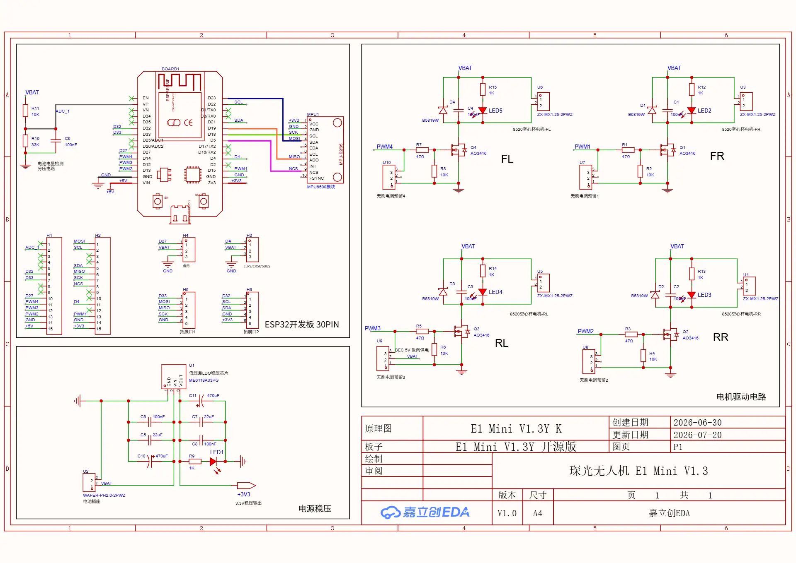
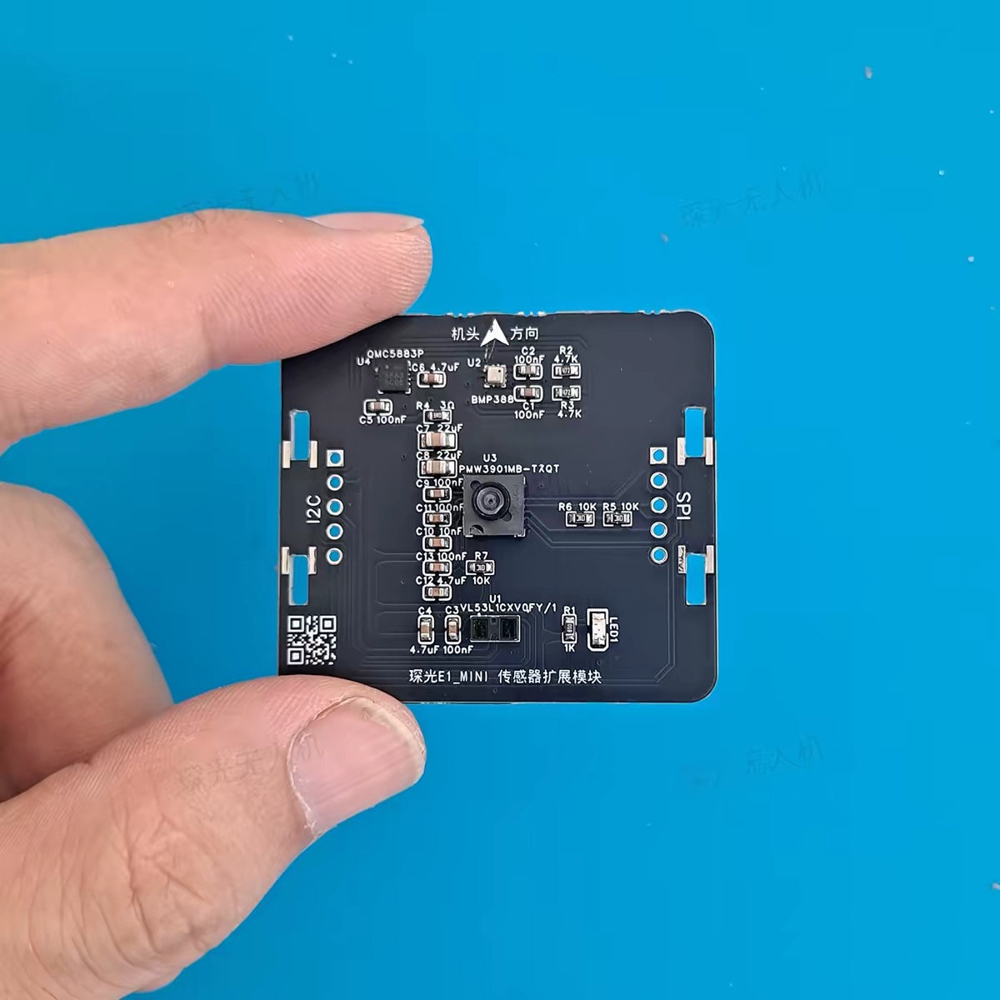

# ESP32-D 电路图与当前扩展接线

记录日期：2026-10-06。原图由用户提供，完整原始 PNG 保存于本目录。

图纸标题：E1 Mini V1.3Y_K / E1 Mini V1.3 开源版；图纸版本 V1.0，创建日期 2026-06-30，更新日期 2026-07-20。上述是图纸标识，不代表当前实物 PCB 版本已经核验。

## 当前设备情况

ESP32-D 固件现分为 D1 仅 IMU、D2 IMU+气压计+磁力计、D3 完整四传感器三种显式编译模式；当前 H5/H6 新设备使用 D3。命令、能力矩阵和产物命名见 [ESP32-D 三种传感器编译模式](ESP32_D_BUILD_PROFILES.md)。

用户确认：**H5、H6 都接入了新设备**，并提供了以下“探光 E1_MINI 传感器扩展模块”照片。实际排线逐针对应与供电连接仍待核验；不得按“未接设备”处理后续诊断。

照片丝印标识（不代表每个芯片都已通信验证）：

| 位号 | 丝印型号 | 用途 | 对应接口判断 |
| --- | --- | --- | --- |
| U4 | QMC5883P | 磁力计 | I²C，预计经 H6 接入 |
| U2 | BMP388 | 气压计 | 当前固件以 I²C 读取，预计经 H6 接入 |
| U3 | PMW3901MB-TXQT | 光流 | SPI，预计经 H5 接入；型号后缀仍以器件资料核验为准 |
| U1 | VL53L1CXV0FY/1（照片丝印） | 测距 | I²C，预计经 H6 接入；完整订货型号待核验 |

模块左侧标 I2C，右侧标 SPI，上方有机头方向箭头。照片不能证明排针引脚顺序与主板 H5/H6 逐针同序，也不能确定 GPIO32/33 的实际功能，需结合扩展模块电路图核验。

2026-10-06 USB 查询已读到 BMP388 和 QMC5883P 响应，与该模块丝印一致。2026-10-07 已增加 PMW3901 光流与 VL53L1X 测距驱动、实时诊断快照和 Web 状态；VL53L1X 已参与低空高度融合，PMW3901 与测距组合生成局部速度/位移影子状态，但尚未进入水平悬停或迫降触地控制。

2026-10-07 磁航向软件阶段已将 QMC5883P 纳入 50 Hz 后台 I²C 采样，旧 `MAG1` 校准可读取并在上锁静止时建立场强基准，新保存使用带场强/质量的 `MAG2`。导航航向对场强 ±20%、60° 最大倾角、100 ms 新鲜度和 20° 创新进行门控。此处仅证明代码与 ESP32-D 构建通过；电机电流造成的磁干扰仍须按四电机分档和约束悬停实测。

## H5：扩展口 1

| 引脚 | 图纸网络 | ESP32 GPIO / 用途 |
| --- | --- | --- |
| 1 | D33 | GPIO33，独立扩展信号，可用作片选，具体用途由设备确定 |
| 2 | MOSI | GPIO23，SPI 主机输出 |
| 3 | MISO | GPIO19，SPI 主机输入 |
| 4 | SCK | GPIO18，SPI 时钟 |
| 5 | GND | 地 |

H5 的 MOSI/MISO/SCK 与板载 MPU6500 IMU 共用 SPI 总线。IMU 的 NCS 为 GPIO5，H5 引出的 GPIO33 为另一信号。H5 图示没有电源引脚，新增模块的电源来源必须另行确认。

## H6：扩展口 2

| 引脚 | 图纸网络 | ESP32 GPIO / 用途 |
| --- | --- | --- |
| 1 | D32 | GPIO32，额外扩展信号，具体用途由设备确定 |
| 2 | SCL | GPIO22，I²C 时钟 |
| 3 | SDA | GPIO21，I²C 数据 |
| 4 | GND | 地 |
| 5 | +3V3 | 3.3 V 供电 |

## IMU 报错排查关联

### 三种配置兼容要求（2026-10-06）

- HW01：仅 IMU、IMU+磁力计/气压计、完整四传感器扩展板均沿用 ESP32-D 引脚，不要求可选外设存在。
- HW02：任何 IMU SPI 初始化前，先将自身 CS 和扩展 PMW3901 CS 置高；先预置输出锁存再切输出，避免片选瞬间拉低。没有扩展板时该操作仅保持预留 GPIO33 为高。
- HW03：H6 各 I²C 地址独立探测，未发现 BMP/QMC 不阻断 IMU。原“不主动驱动测距 XSHUT”决定已由 2026-10-07 的 HW07 取代。
- HW04：增加启动期 PMW3901/VL53L1X 芯片身份探测；CLI 与 Web 区分 detected 与 usable。原“仅启动探测、无运行期采样”范围已由 HW06/HW07 取代。
- HW05：IMU启动最多三次尝试，相邻失败间隔100ms，驱动每次清除旧错误/型号状态；全部失败仍禁止解锁，不在飞行中自动重启IMU。
- HW06：PMW3901 完成初始化后，以有界频率读取运动突发数据，提供原始 X/Y 像素增量、质量、运动标志与样本时间；SPI 访问安排在主循环完成 IMU 读取后，不与 IMU 跨任务并发。
- HW07：VL53L1X 经 GPIO32 释放 XSHUT，按 ST ULD 默认配置启动连续测距，提供距离、量程状态、质量与样本时间；所有 I²C 事务与 BMP388/QMC5883P 共用超时和互斥锁。
- HW08：CLI 与 Web 必须分别展示 detected、ready/usable、读数和样本年龄。仅 IMU、IMU+磁力计/气压计、完整扩展板三种配置均可启动；可选传感器缺失或失效不改变 IMU 解锁门槛。
- HW09：本轮数据只进入传感器接口和诊断展示，不直接进入悬停、位置估计、迫降或触地判定；控制融合需要另行完成坐标标定、陀螺去旋转和飞行验证。
- 实施阶段：单一启动隔离补丁（板型宏→片选初始化→IMU启动），保留传感器探测与飞控安全门槛。静态核对和 ESP32-D 编译后，三种实物组合的冷启动、IMU读数及外设读数仍需板端确认；本次不自动刷写。

当前错误发生于 IMU 初始化写寄存器阶段；不能仅凭错误码判定新增模块导致故障。由于 H5 共用 SPI，后续应核对新增设备片选的实际接线/上电电平、未选中时是否释放 MISO，以及供电和共地。H6 为不同的 I²C 总线，但扩展模块仍可能通过公共供电影响 IMU。

新增排查重点：PMW3901 与 MPU6500 共用 SPI 数据/时钟线。修复前没有在 IMU SPI 访问前配置扩展片选 GPIO33 为非选中高电平；“片选悬空或被选中，干扰共享 MISO”仍是需要实物验证的根因假设。

按用户要求修复后，`spi_bus_startup.h` 在 `setupIMU()` 的 `SPI.begin()` 前预置 IMU CS 和 ESP32-D 的 PMW CS 为高，再切换输出。ESP32-D GPIO33 用途以现有 `BOARD_PMW_CS_PIN` 为依据；S3/C3 不新增扩展片选输出。H6 各传感器仍独立探测，缺失不影响基础 IMU；GPIO32/XSHUT 不新增驱动。没有新增光流/测距读取或改变校准、安全门槛。

验证：ESP32-D `min_spiffs` 构建通过；未新增或运行测试，未刷写/重新上电，也未驱动电机。因此三种实物配置的冷启动与原 ERROR 2 消失尚未验证。若扩展模块不遵守片选释放 MISO 或实际排线并非同序，仍需接线/硬件排查。

图纸保存阶段仅记录接线；后续固件变更与刷写结果见下文。

### 实际测量支持阶段（2026-10-07）

阶段 1（HW06/HW07）：在现有可选探测基础上增加 PMW3901 与 VL53L1X 初始化、非阻塞周期采样及线程安全快照。验收证据为 ESP32-D 构建通过、串口 `sensors` 能区分未安装、已初始化、样本有效/无效，且 IMU 仍正常采样。

阶段 2（HW08/HW09）：把同一份快照接入 `/web_rc/status` 与调试页，显示实时读数、质量和年龄，同时明确当前不参与飞控。验收证据为固件构建、板端状态接口与串口读数一致。

阶段 3：刷写当前 ESP32-D，在上锁、四路电机为零的条件下验证 IMU、BMP388、QMC5883P、PMW3901、VL53L1X。若硬件仍不能应答，记录原始身份/状态与失败阶段，不把“检测到”误报为“可用”。

## 扩展探测实现与参考

2026-10-06 后续用户授权刷写。新增 `drivers/supplementary_sensor_probe.cpp`，仅在ESP32-D启动读取身份寄存器，运行期不轮询共享SPI；I²C事务设置20ms超时。光流/测距结果通过`sensors`、`/web_rc/status`和预检页展示，未检测到不会阻断基础IMU功能。还没有运动/距离数据驱动，不启用位置悬停或触地停机。

协议依据：[Bitcraze PMW3901参考实现](https://github.com/bitcraze/Bitcraze_PMW3901/blob/master/src/Bitcraze_PMW3901.cpp)、[ST VL53L1X ULD说明](https://www.st.com/resource/en/user_manual/um2510-a-guide-to-using-the-vl53l1x-ultra-lite-driver-stmicroelectronics.pdf)。PMW身份与反码双校验；VL53L1X采用16位寄存器地址和双字节身份校验。没有导入完整第三方驱动。

首次刷入隔离/探测版本后IMU仍ERROR 2、光流未识别；保持串口读取进行软件重启后，IMU识别MPU6500、光流身份0x49/0xB6正确，BMP388/QMC5883P正常，VL53L1X未识别。该证据说明故障并非每次启动必现，也不足以锁定唯一硬件原因；因此增加启动重试。完整三配置与断电冷启动验收尚未完成。

### 最终刷写记录（2026-10-06）

- 设备：ESP32-D0WD-V3，MAC `20:50:0d:33:b4:dc`；USB `/dev/cu.usbserial-10`。
- 构建：ESP32-D `min_spiffs`，程序1,432,059 B，静态RAM115,388 B。应用镜像1,432,240 B，SHA-256 `b61c5bcb6b98967331712fcae36dd66cb517880f3862df8b81d3681067c25fd4`。
- 只写app0 `0x10000`，写后哈希通过；保留NVS、分区表和引导程序。源码未提交，构建身份与修改范围见[镜像记录](../../data/attitude/esp32d-expansion-20261006/firmware.json)。
- 硬复位后仍出现IMU ERROR 2与光流未识别，说明三次启动重试并未解决该启动条件。不能签署所有启动方式已恢复。
- 对同一最终镜像软件重启后：IMU `status: OK`、MPU6500 `0x70`、约991 Hz，加速度约9.81 m/s²；`faults=0`；PMW3901身份0x49/0xB6正确；BMP388/QMC5883P正常；VL53L1X `read_ok=0`，未取得身份。
- 最终设备已上锁且四路输出为零。没有发送解锁/手动试转指令；固件的原有开机自检仍保留，本次启动记录为ABORTED。未运行主机测试、三种物理组合测试或带桨飞行。
- [硬复位后状态](../../data/attitude/esp32d-expansion-20261006/final-postflash.log)、[最终软件重启状态](../../data/attitude/esp32d-expansion-20261006/final-soft-reboot.log)。后续需核验扩展排线、XSHUT/供电及硬复位时共享SPI的真实电平。

### 光流与测距实测（2026-10-07）

- PMW3901：采用完整性能寄存器初始化和 2 MHz SPI Mode 3 Motion Burst；主循环在 IMU 读取后每 10 ms 顺序采样。板端连续样本约 100 Hz，身份 `0x49/0xB6`，`ready=1`，本次静止读数 `dx=0 dy=0`、质量 1–3，传输失败 0。
- VL53L1X：GPIO32 对 XSHUT 执行启动复位，加载 ST ULD 默认配置，长距离模式、50 ms 预算/周期；后台任务与 BMP388/QMC5883P 共用 I²C 互斥锁。板端身份与初始化成功，连续输出原始状态 9（归一化状态 0），传输失败 0。实测机体当前放置姿态下距离为 0 mm，低于有效距离判定，因此 `valid=0`；需让下视镜头与目标表面保持至少 4 cm 后复核非零距离。
- 状态语义：`detected` 表示身份正确，`ready` 表示完整初始化成功，`usable` 表示最近样本有效且未过期。光流角增量已用于带陀螺去旋转和距离缩放的影子估计；传感器坐标与比例仍未完成实机标定，因此不进入水平闭环。
- 最终构建：程序 1,437,799 B（73%），静态 RAM 115,468 B（35%）；镜像 1,437,984 B，SHA-256 `516d1f955e1e2d7ecab6180dfd43a8dd48206b3773cf4dc99216985a30ef862c`。只写 app0 `0x10000`，写后哈希通过，保留 NVS、分区表和引导程序。
- 最终软件重启状态：IMU 为 MPU6500 `0x70`、约 990 Hz；BMP388/QMC5883P、PMW3901、VL53L1X 均初始化；`faults=0`。设备保持上锁，四路电机输出均为 0。
- 已知未解决：写入后的 RTS 硬复位仍复现 IMU `ERROR 2`，软件重启后恢复。该问题早于本轮实际测量驱动，不能将本轮光流/测距成功视为硬复位 IMU 问题已经修复。

实现依据：[ST VL53L1X ULD](https://www.st.com/en/embedded-software/stsw-img009.html)、[Linux VL53L1X 驱动中的 ST 默认配置与初始化流程](https://kernel.googlesource.com/pub/scm/linux/kernel/git/stable/linux-stable.git/+/4437ad129cf5b37c00a5bc9fa5989d1da4d64d07/drivers/iio/proximity/vl53l1x-i2c.c)、[Bitcraze PMW3901 驱动](https://github.com/bitcraze/Bitcraze_PMW3901/blob/master/src/Bitcraze_PMW3901.cpp)。

### RTS 硬复位片选时序排查（2026-10-07）

- RTS-CS-1：在 GPIO 输出接管前预置真实输出锁存器，接管后确认 HIGH；ESP32-D 的 IMU/PMW 两个片选在首次 SPI 传输前均不被选中，C3/S3 保持原片选范围。实现边界为 `spi_bus_startup.h`；回归模拟 Arduino-ESP32 3.x 对未注册 GPIO 的 digitalWrite 无效行为，检查低电平瞬态、重复调用及其他引脚不受影响。
- 单阶段补丁：仅改变片选预置 API，保持现有 setup 顺序、SPI 配置、三次重试和安全门槛；先验证回归红/绿及 ESP32-D 构建，再进行同板硬复位验收。板端诊断镜像关闭开机电机自检，避免复位循环驱动电机。
- ERROR 2 的直接含义是 USER_CTRL(0x6A)=0x20 写后回读失败；WHO_AM_I 尚未读取，日志中的 0x00 是缓存初值，不能据此断言芯片身份寄存器读到了零。
- 本机核心 `esp32/3.3.8-cn/cores/esp32/esp32-hal-gpio.c` 与 [Espressif 3.3.8 源码](https://github.com/espressif/arduino-esp32/blob/3.3.8/cores/esp32/esp32-hal-gpio.c) 均表明 digitalWrite 仅对已注册 GPIO 写 gpio_set_level。原先 digitalWrite(HIGH)→pinMode(OUTPUT) 无法可靠预置片选，PMW 在随后初始化之前可能保持被选中。这是代码缺陷的证据；它是否足以解释全部硬复位失败，仍需板端验证。
- [TDK MPU-6500 产品说明 §6.1](https://invensense.tdk.com/wp-content/uploads/2020/06/PS-MPU-6500A-01-v1.3.pdf) 另要求在可访问寄存器后尽早设置 I2C_IF_DIS；[寄存器说明 §4.33](https://invensense.tdk.com/wp-content/uploads/2015/02/MPU-6500-Register-Map2.pdf) 指出该位自清除。现有驱动未显式设置该位；若片选修复后仍失败，再单独验证接口切换，不能使用当前逐字节相等回读直接验证自清除位。
- RTS-CS-1 主机验证：旧实现触发 `drivenLow.empty()` 断言失败；修复后三板型通过，IMU 无效样本恢复回归通过，`git diff --check` 通过。ESP32-D full、关闭开机自检构建通过（程序 1,467,167 B，静态 RAM 122,620 B）；[诊断镜像记录](../../data/attitude/imu-rts-20261007/firmware.json) 包含应用 SHA-256 和完整构建身份。
- 板端验收待完成：本轮读 MAC 确认为 `20:50:0d:33:b4:dc`，之后备份应用时遇到独占锁；查得另一个 `esptool` 正向同一串口写入 `/private/tmp/cf-drone-range-flow-calibration-build/CF-Drone.ino.bin`。本轮没有刷写片选修复镜像，也未完成修复后复位统计；原始串口输出有损坏，不能作为独立对照。待串口归属明确后，再只写 app0 并验证至少十次 RTS 复位、软件重启与断电冷启动，记录每次 IMU/PMW 身份、采样频率、故障和电机零输出。
- 全量主机测试停在既有 `test_descent_calibration.cpp` 与 `descent_calibration.h` 接口不匹配（旧 thrustCenti/start/stop/usable 字段或方法）；本补丁不修改下降校准。该失败不能报告为全量回归通过。
- 用户已确认优先光流/测距板端任务，本轮仅交付 IMU 补丁与资料；RTS-CS-1 状态为主机验证通过、板端验证明确延期，不能宣称 ERROR 2 已根除。

### MPU6500 冷启动初始化修复（2026-10-07）

- 后续代码复核确认 `ERROR 2` 来自驱动在读取 `WHO_AM_I` 之前写入 `USER_CTRL.I2C_MST_EN`。板载器件实际为 MPU6500，不包含 MPU9250 的内部 AK8963，因此基础六轴启动不应依赖这项内部 I²C 主控配置。
- `MPU9250::begin()` 现在先等待传感器上电稳定，执行软复位并等待恢复，再读取 `WHO_AM_I`。MPU6500 跳过 AK8963/I²C 主控初始化；MPU9250/MPU9255 保留原内部磁力计初始化路径。初始化失败仍保持 `imuOK=false` 并禁止解锁。
- `flowcal start` 同时检查 PMW3901 是否初始化；full 固件运行在仅 IMU 硬件时返回 `FLOW_CAL unavailable`，不再进入永远没有样本的伪校准状态。
- ESP32-D 默认 full 构建通过：程序 1,468,375 B，静态 RAM 122,620 B。关闭开机电机自检的板端诊断构建同样通过：程序 1,467,263 B，静态 RAM 122,620 B。
- 板端诊断镜像刷写因需要显式授权关闭开机电机自检而未执行。当前结论是代码与构建完成，RTS/断电复位统计仍未完成；在取得该安全配置授权前，不刷写会自动执行电机自检的默认镜像代替诊断镜像。
